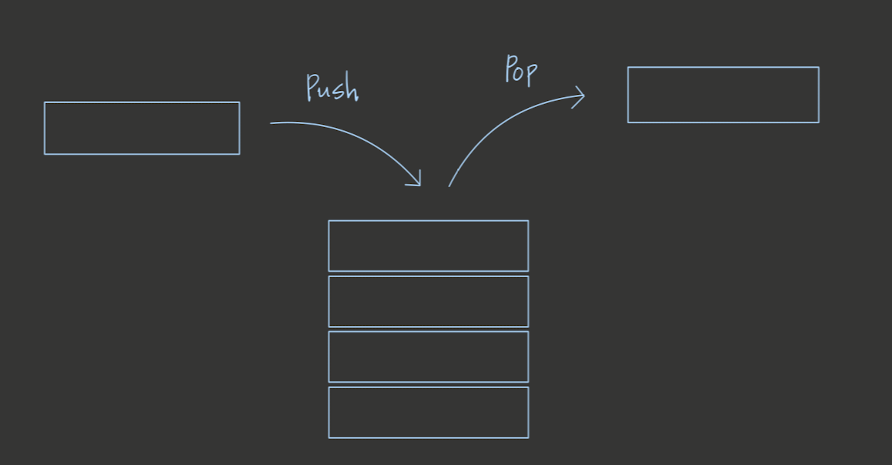
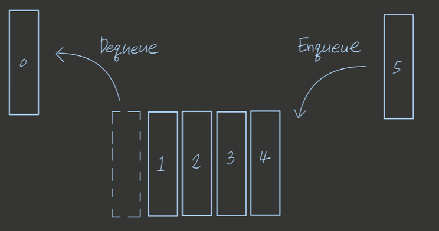

# Stack

- Stack은 data가 _쌓이는_ 구조이다.
- data가 들어오면 data는 들어오는 순서대로 탑처럼 쌓이면서 메모리에 저장된다.
- Stack에서 data를 꺼내면 Stack에서 가장 나중에 들어온 data, 즉 탑으로 치면 가장 위에 위치한 data를 불러온다.
- 따라서 Stack 은 먼저 저장되는 data일수록 늦게 불려지는 First-In-Last-Out 방식의 자료 구조이다.
- stack 중간에 data를 삽입하거나 제일 끝단에 data를 붙이거나 하는것은 불가능 하고 data 추가, 삭제, 가져오기만 가능하다.
- Big-O Notation 기준으로 가져오기:O(n), 추가하기:O(1), 삭제하기:O(1) 의 시간복잡도를 갖는다.

  ## How Stack Works

  

  ## Stack 구현하기

  ```js
  class Stack {
    constructor() {
      this.storage = {}
      this.top = 0
    }

    size() {
      return this.top
    }

    push(element) {
      this.storage[this.top] = element
      this.top++
    }

    pop() {
      let result = this.storage[this.top - 1]
      delete this.storage[this.top - 1]
      this.top--
      if (this.top < 0) {
        this.top = 0
      }
      return result
    }
  }
  ```

# Queue

- Queue 는 data 들의 줄을 세우는 방식의 자료 구조이다.
- data가 들어오면 data는 들어오는 순서대로 줄을 잇는다.
- Queue에서 data를 꺼내면 Queue에서 가장 먼저 들어왔던 data, 즉 줄로 치면 가장 앞에 있는 data를 불러온다.
- 따라서 Queue는 먼저 저장되는 data가 먼저 불려지는 First-In-First-Out 방식의 자료 구조이다.
- Queue 중간에 data를 삽입하거나 제일 끝단에 data를 붙이거나 하는것은 불가능 하고 data 추가, 삭제, 가져오기만 가능하다.
- Big-O Notation 기준으로 가져오기:O(n), 추가하기:O(1), 삭제하기:O(1) 의 시간복잡도를 갖는다.

## How Queue Works



## Queue 구현하기

```js
class Queue {
  constructor() {
    this.storage = {}
    this.front = 0
    this.rear = 0
  }

  size() {
    return Object.keys(this.storage).length
  }

  enqueue(element) {
    this.storage[this.rear] = element
    this.rear++
  }

  dequeue() {
    let result = this.storage[this.front]
    delete this.storage[this.front]
    this.front++
    return result
  }
}
```
