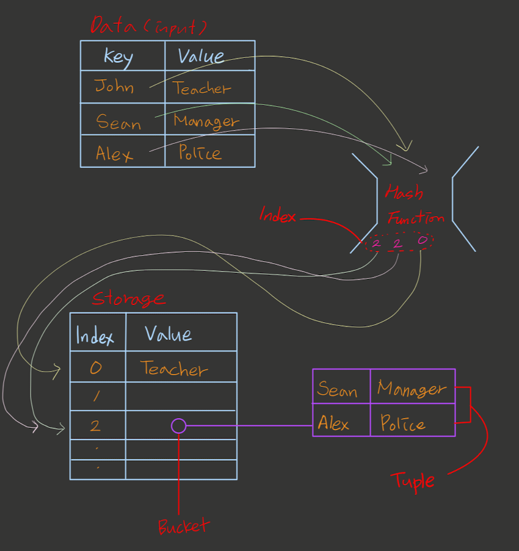

# Hash Table

- Hash Map 이라고도 불리우는 Hash Table은 key와 value의 쌍을 갖는 data를 저장할 수 있는 자료구조이다.
- 어떤 data가 주어졌을 때 `Hash Function`을 통해서 그 data는 `index` type의 고유한 `hash code`(해쉬값)를 받게 되고 메모리상에 임의의 공간(`storage`)안에 해당 index 위치(`address`)에 data를 저장하는 방식이다.
- Hash Function의 특징
  - 어떤 data(input data)에 대해서 항상 같은 hash code(output)을 반환해야 한다. - _Deterministic_
  - 무슨 data가 들어와도 고유한 hash code를 반환해야 한다. - _Collision Resistance_
  - output 값을 토대로 input값을 유추할 수 없다. - _Preimage Resistance_
  - 무슨 data가 들어와도 동일한 길이의 값을 반환한다. - _Fixed Size Output_
- 하지만 일반적으로 우리가 구현하는 Hash Function은 무한한 input data에 대해서 유한한 output data를 반환하기 때문에 data 충돌 `collision`이 발생할 수 있다.
- 만약 Hash Table안에서 어떤 data에 접근하려고 할 때 hash table안에 있는 모든 데이타를 확인할 필요없이 index 역할을 하는 hash code를 통해서 그 data의 address에 바로 접근을 할 수 있기때문에 연산속도가 빠르다는 장점이 있는 자료구조이다.
- Hash Table은 Big-O Notation 기준으로 가져오기:O(1), 추가하기:O(1), 삭제하기:O(1) 의 시간복잡도를 갖는다.

## How Hash Table Works



- **storage**안에 각각의 index는 data가 저장되는 공간으로서 `bucket`이라고 한다.
- 만약 key-value 형태의 한 쌍의 data를 저장한다고 했을 때, bucket에 저장되는 data는 key-value의 pair 형태로 저장되고 이때 그 각각의 pair data는 `tuple`이라고 한다.
- Hahs Table은 저장하고 있는 Data의 양에 따라서 유동적으로 메모리 크기를 늘리거나 줄일 수 있다.
  - 일반적으로 hash table은 data가 storage의 75%이상을 차지하게 될 경우 storage를 늘리고 25% 이하로 떨어질 경우 storage를 줄인다.
- 어떤 index에 data를 저장하려고 할 때 이미 해당 index에 data가 존재하는 경우를 `collision`이라고 하고 solution으로서는 `open addressing`과 `Chaining` 이 있다.
- Chaining은 bucket을 linked list의 형태로 저장하고 해당 index로 들어오는 data를 계속 연결하여 저장하는 방식이다.
- Open Addressing은 본래 저장하려고 했던 index에 data가 존재하는 경우 비어있는 index를 찾아서 data를 저장하는 방식이다.

## Hash Table 코드로 구현하기

```js
const LimitedArray = function(limit) {
  const storage = []

  const limitedArray = {}
  limitedArray.get = function(index) {
    checkLimit(index)
    return storage[index]
  }
  limitedArray.set = function(index, value) {
    checkLimit(index)
    storage[index] = value
  }
  limitedArray.each = function(callback) {
    for (let i = 0; i < storage.length; i++) {
      callback(storage[i], i, storage)
    }
  }

  var checkLimit = function(index) {
    if (typeof index !== 'number') {
      throw new Error('setter requires a numeric index for its first argument')
    }
    if (limit <= index) {
      throw new Error('Error trying to access an over-the-limit index')
    }
  }

  return limitedArray
}
```

LimitedArray 함수는 결과값으로 객체를 리턴하고 Hash Table의 storage 역할을 하는 임의 배열을 생성한다. 리턴되는 객체는 storage역할을 하는 배열에 data를 추가, 접근, 각 배열의 요소를 돌면서 어떤 작업을 할 수 있는 함수를 갖고있는 객체이다.

```js
const hashFunction = function(str, max) {
  let hash = 0
  for (let i = 0; i < str.length; i++) {
    hash = (hash << 5) + hash + str.charCodeAt(i)
    hash &= hash // Convert to 32bit integer
    hash = Math.abs(hash)
  }
  return hash % max
}
```

data를 받아서 그 data 에 대한 index값을 리턴하는 hash function을 만든다.

```js
class Node {
  constructor(key, value) {
    this.key = key
    this.value = value
    this.next = null
  }
}

class LinkedList {
  constructor() {
    this.head = null
    this.tail = null
    this._size = 0
  }
}
```

Hash Table Bucket에 data가 저장될 때 각 Bucket은 Linked List의 형태로 저장되고 data는 그 Linked List에 Head값으로 저장된다.

```js
class HashTable {
  constructor() {
    this._size = 0
    this._limit = 8
    this._storage = LimitedArray(this._limit)
  }

  insert(key, value) {
    if (this._size + 1 > (this._limit * 3) / 4) {
      this._resize(this._limit * 2)
    }

    const index = hashFunction(key, this._limit)
    // 1. 해싱충돌이 없을 때
    // 1-1. array storage 안의 index 값에 value 가 들어 있는지 확인해서 아무것도 안들어있으면 linked list 로 생성해서 넣는다.
    // 1-2. linked list 의 head 값에 받아온 key 와 value를 갖고 있는 노드를 생성하여 할당한다.
    if (!this._storage.get(index)) {
      let linkedList = new LinkedList()
      this._storage.set(index, linkedList)
      this._storage.get(index).head = new Node(key, value)
      this._storage.get(index)._size++
      this._size++
    } else {
      // 2. 해싱충돌이 있을 때
      // 2-1. 해당 인덱스에 linkedList 의 head값을 바꾸고 이전 head값을 새로운 head 의 next 값으로 지정한다.
      // 2-2-1. hash table 안에 이미 똑같은 key를 갖고 있는 node가 있을 때
      let linkedList = this._storage.get(index)
      let current = linkedList.head
      if (this.retrieve(key)) {
        for (let i = 0; i < linkedList._size; i++) {
          if (current.key === key) {
            current.value = value
          } else {
            current = current.next
          }
        }
      } else {
        // 2-2-2. hash table안에 똑같인 key 값이 없을 때
        linkedList.head = new Node(key, value)
        linkedList.head.next = current
        linkedList._size++
        this._size++
        if (linkedList._size === 2) {
          linkedList.tail = current
        }
      }
    }
  }

  retrieve(key) {
    const index = hashFunction(key, this._limit)

    let linkedList = this._storage.get(index)
    let current = linkedList.head
    for (let i = 0; i < linkedList._size; i++) {
      if (current.key === key) {
        return current.value
      } else {
        current = current.next
      }
    }
  }

  remove(key) {
    if (this._limit > 8 && this._size - 1 < this._limit / 4) {
      this._resize(this._limit / 2)
    }
    const index = hashFunction(key, this._limit)
    if (this.retrieve(key)) {
      let linkedList = this._storage.get(index)
      let previous = linkedList.head
      if (previous.key === key) {
        linkedList.head = previous.next
        linkedList._size--
        this._size--
      } else {
        for (let i = 0; i < linkedList._size; i++) {
          if (previous.next.key === key) {
            previous.next = previous.next.next
            if (i === linkedList._size - 1) {
              linkedList.tail = previous
            }
            linkedList._size--
            this._size--
          } else {
            previous = previous.next
          }
        }
      }
    }
  }

  _resize(newLimit) {
    let originStorage = this._storage
    this._limit = newLimit
    this._storage = LimitedArray(this._limit)
    this._size = 0
    let hash = this
    originStorage.each(function(linkedList) {
      if (linkedList) {
        let current = linkedList.head
        for (let j = 0; j < linkedList._size; j++) {
          hash.insert(current.key, current.value)
          current = current.next
        }
      }
    })
  }
}
```

class Hash Table 을 통해서 생성된 어떤 hash table은 insert, retrieve, remove, \_resize 와 같은 method를 통해 hash table에 data를 저장, 불러오기, 삭제, resizing storage들을 할 수 있다.
