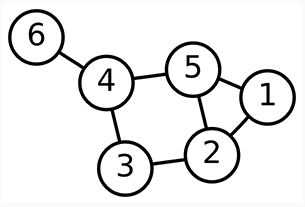
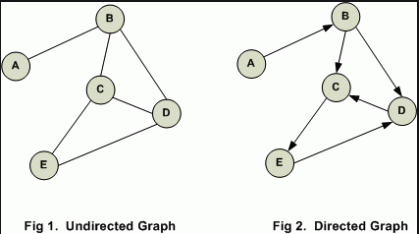
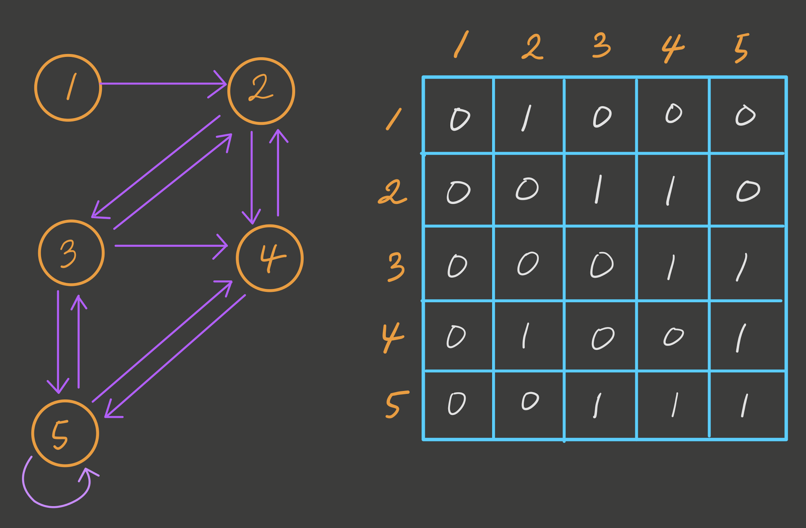

# 🔎 Graph



- graph는 Node(_또는 Vertex 라고도 부른다_)들의 연결로서 이루어진 자료구조이다.
- graph에서 모든 node는 하나 이상의 다른 node와 연결되어 있다.
- graph는 Node를 서로 연결하는 edge로 구성되고 edge의 방향성에 따라서 **undirected graph** or **directed graph** 로 구분된다. undirected 는 어떤 node에서 다른 node로 한 방향으로만 연결된 비대칭 edge가 있는 graph이고 undirected는 모든 node가 자신과 연결된 node에 대해서는 양방향을 서로 바라봄으로서 대칭 구조를 이루고 있는 graph이다.
- parent node - child node 의 개념이 존재하지 않는다.

## 📌 Terms of Graph

| Terms             |                                        Means                                        |
| ----------------- | :---------------------------------------------------------------------------------: |
| `vertex`          |                               graph 상의 각각의 Node                                |
| `edge`            |             graph상의 각각의 Node들을 연결하는 간선 (또는 link, branch)             |
| `adjacent vertex` |                    edge에 의해서 직접 연결된 vertex (인접 node)                     |
| `degree`          | undirected graph에서 노드에 연결된 차수: total degree = 2\*edge on undirected graph |
| `in-degree`       |       directed graph에서 어떤 node를 기준으로 그 node로 들어오는 방향의 edge        |
| `out-degree`      |       directed graph에서 어떤 node를 기준으로 다른 node로 나가는 방향의 edge        |
| `cycle`           |                  directed graph에서 node 들의 연결이 순환되는 구조                  |

# 🔎 directed graph vs undirected graph



# 🔎 graph를 표현하는 방법

1. Adjacency Matrix

   - vertex(node)의 갯수가 n개라고 한다면 n^2 만큼의 메모리 공간에 정수 0과 1로 각 노드에 인접한 node들을 저장하여 graph를 구현하는 방식이다.
   - O(n^2)의 공간복잡도를 갖는다.<br>

     

2. Adjacenty List

   - vertex(node)의 수만큼 배열형식으로 저장한후 각 노드의 연결된 노드들을 Linked List형식으로 저장하여 graph를 구현하는 방식이다.
   - O(n+e)의 공간 복잡도를 갖는다. (n: vertex의 갯수, e:edge의 갯수)

     

3) Time & Space Complexity
   - vertex의 추가는 <span style="color:red; font-size:1rem;">Adjacency List</span> 방식이 효율적이다.
   - vertex의 삭제는 <span style="color:red; font-size:1rem;">Adjacency List</span> 방식이 효율적이다.
   - edge의 추가와 삭제가 빈번히 일어나는 경우에는 <span style="color:red; font-size:1rem;">Adjacency Matrix</span> 방식이 효율적이다.

# 🔎 graph search

1.  Depth-First Search (DFS)

    - 깊이 우선 탐색 방식은 시작 Node 기준으로 다음 각각의 branch들을 다 검사하고 다음 branch로 넘어가서 검사하는 방식이다.


        

    - 모든 node를 검사할 때 사용한다.
    - Breadth-First Search(BFS) 보다 간단하다.
    - 탐색속도는 BFS에 비해서 느리다.

    <br>**Stack을 이용하여 DFS 구현 방식**

    1. 시작node를 stack에 추가
    2. stack에 저장되있는 node 하나 꺼내기
    3. stack에서 꺼내온 node의 branch node 들을 stack에 추가
    4. 꺼내온 node 출력
    5. 위의 #2,#3,#4 step을 끝날때까지 반복<br>
       **_stack에 한번 들어갔던 node는 skip하면서 순회_**
       <br><br>

2. Breadth-First Search (BFS)

   - 넓이 우선 탐색 방식은 시작 Node 기준으로 바로 인접한 모든 branch들을 먼저 다 검사하고 그 다음에 branch의 branch로 넘어가서 똑같은 방식으로 검사하는 방식이다.

    

   - 시작 node 기준으로 가까운 node들을 우선순위로 순회하여 탐색
   - 특정 두 node 사이에 어떤 node를 찾을 때 유요한 탐색방식이다.

   <br>**Queue를 이용하여 BFS 구현 방식**

   1. 시작node를 queue에 추가
   2. queue에서 node 하나 빼오기
   3. queue에서 빼온 node의 branch node들을 queue에 추가
   4. 꺼내온 node 출력
   5. 위의 #2,#3,#4 step을 끝날때까지 반복<br>
      **_queue에 한번 들어갔던 node는 skip하면서 순회_**

# 💻 Embodied graph by coding

```js
class Graph {
  constructor () {
    this.nodes = {}
    /* nodes = {
    *       0: [1,2],
    *       1: [0],
    *       2: [0]
    *   }
    */
  }
}

  addNode(node) {
      this.nodes[node] = this.nodes[node] || []
    }


  contains(node) {
    if (this.nodes[node]) {
      return true
    } else {
      return false
    }
  }


  removeNode(node) {
    if (this.nodes[node]) {
      for (let i of this.nodes[node]) {
        for (let j in this.nodes[i]) {
          if (this.nodes[i][j] === node) {
            if (j === 0) {
              this.nodes[i].shift()
            } else {
              this.nodes[i].splice(j, j+1)
            }
          }
        }
      }
      delete this.nodes[node]
    }
  }


  hasEdge(fromNode, toNode) {
    if (this.nodes[fromNode]) {
      if (this.nodes[fromNode].includes(toNode)) {
        return true
      }
    }
    return false
  }


  addEdge(fromNode, toNode) {
    if (this.nodes[fromNode] && this.nodes[toNode]) {
      this.nodes[fromNode].push(toNode)
      this.nodes[toNode].push(fromNode)
    }
  }


  removeEdge(fromNode, toNode) {
    let fromNodeArr = this.nodes[fromNode]
    let toNodeArr = this.nodes[toNode]
      for (let i in fromNodeArr) {
        if (fromNodeArr[i] === toNode) {
          if (i === 0) {
            fromNodeArr.shift()
          } else {
            fromNodeArr.splice(i, i+1)
          }
        }
      }
      for (let i in toNodeArr) {
        if (toNodeArr[i] === fromNode) {
          if (i === 0) {
            toNodeArr.shift()
          } else {
            toNodeArr.splice(i, i+1)
          }
        }
      }
  }
}
```
