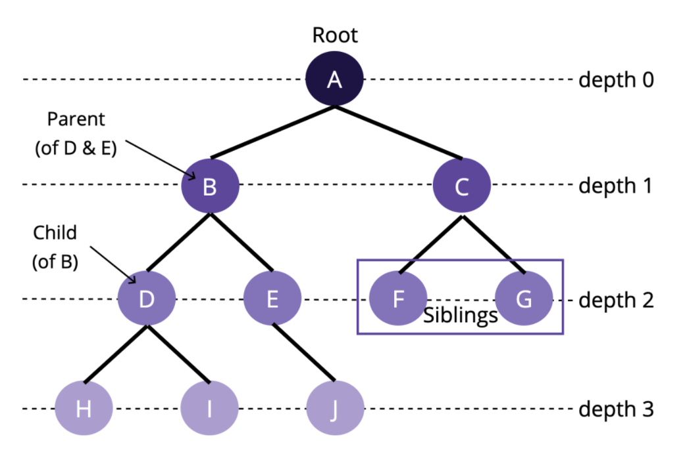
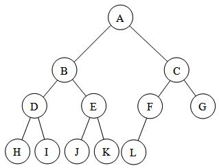
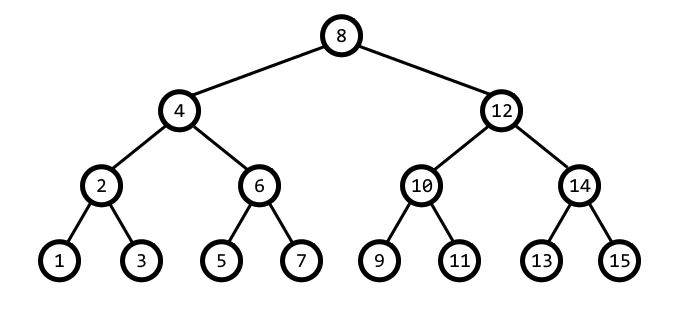
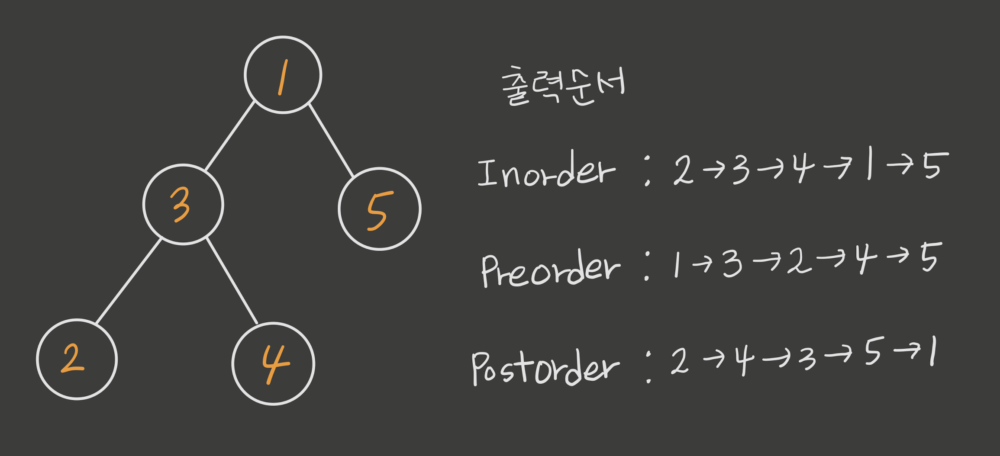

# 🔎 Tree

- Tree는 node로 구성된 계층적 자료구조이다. 최상위 node인 `Root Node`를 만들고 root node의 branch가 되는 `Child Node`를 추가하는 방식으로 tree 구조가 만들어진다.
- Tree 구조는 graph 구조의 한 종류이고 한방향으로만 이어지는 완전 비대칭 directed graph의 한 종류라고 할 수 있다.
- Tree 구조에는 Cycle이 존재하지 않는다.
- Node가 n개인 tree는 항상 n-1 개의 edge를 갖는다.
- root node에서 어떤 특정 node로 가는 길은 유일하다.
- root node를 제외한 모든 node는 오직 한개의 parent node를 갖는다.
- 0개 이상의 child node를 갖는다.

## 📌 Terms of Graph



## 💻 Embodied Tree Data Structure by coding

```js
class TreeNode {
  constructor(value) {
    this.value = value
    this.children = []
  }

  insertNode(value) {
    this.children.push(new TreeNode(value))
  }

  contains(value) {
    if (this.value === value) {
      return true
    } else {
      for (let i = 0; i < this.children.length; i++) {
        if (this.children[i].contains(value)) {
          return true
        }
      }
    }
    return false
  }
}
```

# 🔎 Binary Tree

일반적인 Tree 구조는 0개 이상의 child node를 갖고 있는게 특징이지만 그 중에 최대 2개의 child node를 갖는 tree 구조를 `Binary Tree`라고 한다.

## Binary Tree 의 종류

1.  <span style="color:orange; font-size:1.5rem;">Complete Binary Tree</span>

    - tree의 마지막 level을 제외하고 모든 node가 꽉 채워져 있다.
    - tree의 마지막 level은 꽉 채워져 있지는 않아도 되지만 왼쪽부터 오른쪽으로 채워져야 한다.
    - 마지막 level의 어떤 node의 child node로서 left child node만 있다면 complete Binary Tree가 _맞다_
    - 마지막 level의 어떤 node의 child node로서 right child node만 있다면 complete Binary Tree가 _아니다_

      <br>

2.  <span style="color:orange; font-size:1.5rem;">Full Binary Tree</span>

    - 모든 node가 무조건 0 또는 2개의 childe node를 갖는 binary tree 구조이다.
    - 어떤 node가 단 한개의 childe node를 갖는다면 그것은 Full Binary Tree가 _아니다_

      <br>

3.  <span style="color:orange; font-size:1.5rem;">Perfect Binary Tree</span>

    - tree 의 0번째 height 또는 제일 깊은 depth의 node들을 제외한 모든 node가 2개의 child node를 갖고 있는 binary tree
    - 말 그대로 꽉 차있는 binary tree 구조
    - node 의 갯수는 2^h-1 을 갖는다. (여기서 h는 tree의 높이 height)

      <br>

4.  <span style="color:orange; font-size:1.5rem;">Balanced & Unbalanced Binary Tree</span>

    - Balanced Binary Tree구조는 O(logn)의 시간복잡도로 node를 insert 와 find를 할 수 있을 정도로 균형이 잡혀있는 binary tree 구조이다.
    - Unbalanced Binary Tree 구조는 같은 depth의 위치한 node중에 한 node가 다른 node에 비해 2 depth 이상 더 들어갈 경우 균형이 잡혀있지 않은 구조라고 볼 수 있다.

    <br>

5.  <span style="color:orange; font-size:1.5rem;">Binary Search Tree</span>

    - 어떤 parent node의 2개의 child node가 있을 때, parent node의 left child node는 parent node보다 작은 value를 갖는 node이고 right child node는 parent node 보다 큰 value를 갖는 node이다.

           

## Binary Tree Traversal

1. Inorder Traversal

   - Left Child Node -> Current Node -> Right Child Node 순서로 전체 node를 순회하며 확인하는 방법이다.

2. Preorder Traversal

   - Current Node -> Left Child Node -> Right Child Node 순서로 전체 node를 순회하며 확인하는 방법이다.

3. Postorder Traversal

   - Left Child Node -> Right Child Node -> Current Node 순서로 전체 node를 순회하며 확인하는 방법이다.

   

# 💻 Embodied Search Tree Data Structure by coding

```js
class BinarySearchTreeNode {
  constructor(value) {
    this.value = value;
    this.left = null;
    this.right = null;
  }
```

- 자신node의 value와 2개의 child node를 바라보는 left, right 을 갖는 class 를 생성한다.

```js
  insert(value) {
    if (value < this.value) {
      if (!this.left) {
        this.left = new BinarySearchTreeNode(value)
      } else {
        this.left.insert(value)
      }
    } else if (value > this.value) {
      if (!this.right) {
        this.right = new BinarySearchTreeNode(value)
      } else {
        this.right.insert(value)
      }
    }
  }
```

- class의 method로 node를 tree 구조에 삽입하는 insert 함수를 생성

```js
  contains(value) {
    if (value === this.value) {
      return true
    } else if (value < this.value ) {
      if (this.left === null) {
        return false
      } else {
        return this.left.contains(value)
      }
    } else if (value > this.value) {
      if (this.right === null) {
        return false
      } else {
        return this.right.contains(value)
      }
    }
  }
```

- class의 method로 어떤 value를 갖는 node가 tree 구조안에 있는지 확인하는 contains 함수 생성
- contains 함수는 DFS 방식으로 순회하며 검사한다.

```js
inorder(callback) {
    if (!this.left) {
      callback(this.value)
      if(this.right) {
        this.right.inorder(callback)
      }
    } else {
      this.left.inorder(callback)
      callback(this.value)
    }

    if (this.left && this.right) {
      this.right.inorder(callback)
    }

  }
```

Inorder Traversal방식으로 모든 node를 순회하며 callback함수를 인자로 받아서 각 node에 적용하는 inorder 함수 생성
