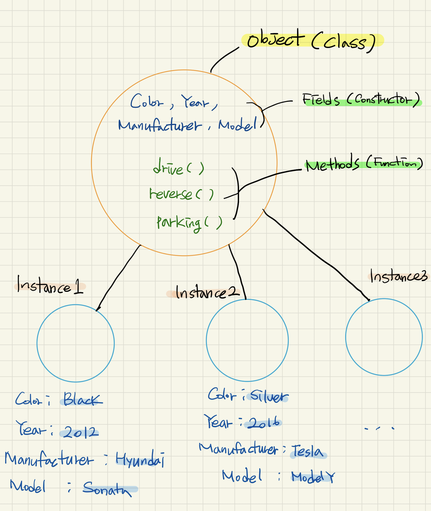

# What is Object Oriented Programming (OOP)?

- 객체지향언어로서 인간의 사고방식과 가깝게 구현한 프로그래밍 언어 방식이라고 할 수 있다. 데이터들을 object라는 객체방식으로 관리하고 그 object 들의 상호작용을 통해 프로그래밍을 하게 한다.

# What is OOP's benefit or feature?

- _Encapsulation_
  - Encapsulation 이란 일정한 데이터들의 일관된 속성 또는 함수들을 Object 안에 집약시켜 모아놓을 수 있다.
- _Inheritance_
  - 상속이라는 의미로 부모 Class Object를 통해서 Instance Object가 생성이 되었을 때 그 Instance Object를 Class Object가 갖고 있는 Field나 Method 를 그대로 받아서 사용할 수 있다.
- Abstraction
  - 추상적으로 표현을 한다라는 의미로 생각한다. 내부적으로 프로그래밍된 어떤 application이 본래 만들어진 목적에 맞게 구현될 수 있다. 사용자는 그 application이 내부적으로 어떻게 작용하는지 몰라도 그걸 통해서 원하는 기능을 사용하고 원하는대로 쉽게 조작할 수 있다.
- Polymorphism

  - 하나의 부모 객체를 통해 생성된 Instance들은 부모객체의 성질을 상속 받지만 각각은 그 목적에 맞게 다양한 기능들을 추가 또는 변형을 할 수 있고 이를 통해 다형성을 갖게 된다.

  # How deos OOP work?



- class object 안에 field와 method들을 일괄적으로 모아서 encapsulation 할 수 있다.
- 생성된 instance들은 class object의 filed를 통해서 각각의 데이터를 갖고 부모객체의 함수를 사용한다.

Class Object 는 다음과 같이 선언한다.

```js
class Car {
  constructor(color, year, manufacturer, model) {
    this.color = color
    this.year = year
    this.manufacturer = manufacturer
    this.model = model
  }

  drive() {
    console.log(`${this.model} in ${this.color} moves forward`)
  }

  parking() {
    console.log(`${this.model} has been parked at ${this.manufacturer}`)
  }
}
```

Car라는 Object 를 통해 새로운 Instance를 생성한다.

```js
let car1 = new Car('black', '2020', 'hyundai', 'elantra')
```

생성한 car1 instance를 통해서 부모 object의 method를 사용할 수 있다.

```js
car1.dirve()
// => elantra in black moves forward
car1.parking()
// => elantra has been parked at hyundai
```

# JavaScript 를 객체지향적인 언어로서 사용하기

### 1. Functional

- 객체를 리턴하는 함수를 만든다.
- 함수를 실행한 결과값을 새로운 변수에 할당한다.
- 그럼 그 변수는 dot notation을 통해 객체의 property에 접근 사용할 수 있다.

```js
let Employee = function() {
  let instance = {}
  instance.wage = 12
  instance.raise = function(percent) {
    this.wage = this.wage * percent
  }
  return instance
}

let sean = Employee() // Employee 를 통해 sean 이라는 instance 생성

sean.wage // => 12
sean.raise(1.5)
sean.wage // -> 18
```

### 2. Functional Shared

- 어떤 객체로 부터 그 객체가 갖고 있는 Property를 다른 객체에 넣는 함수를 생성한다.(`addProperty`)
- instance가 생성될 때 각각의 instance들이 받을 수 있는 field 또는 function 을 갖는 객체를 생성한다.(`someMethods`)
- instance 객체를 리턴하는 함수(`Employee`)를 생성하고 그 함수가 실행되면서 함수 `addProperty`가 실행된다.
- `Employee` 는 `someMethods` 가 갖고 있는 모든 property 를 갖는 객체 `instance`를 리턴한다.
- 변수 `sean`은 `Employee` 함수를 통해서 생성된 instance 가된다.

```js
let addProperty = function(to, from) {
  for (let key in from) {
    to[key] = from[key]
  }
}

let someMethods = {}
someMethods.wage = function(percent) {
  this.wage = this.wage * percent
}

let Employee = function(wage) {
  let instance = { wage: wage }
  addProperty(instance, someMethods)
  return instance
}

let sean = Employee(15)
let lee = Employee(20)
sean.raise(1.8)
sean.wage // => 27
lee.raise(1.2)
lee.wage // => 24
```

**Functional Shared 방식은 Functional 방식 보다 메모리를 덜 차지한다는 점에서 효율적이다.**

### 3. Prototypal

- instance 객체를 리턴하는 함수 `Employee`를 생성한다.
- field 또는 function을 property 로 갖고있는 객체 `someMethods`를 생성한다.
- `Employee`함수에서 instance 객체를 `Object.create` 메소드를 사용하여 어떤 property를 갖고있는 prototype object(부모객체가 될)의 instance object로 만든다.

```js
let someMethods = {}
someMethods.raise = function(percent) {
  this.wage * percent
}

// before changing
function Employee(wage) {
  let instance = {}
  instance.wage = wage
  return instance
}

//after changing
function Employee(wage) {
  let instance = Object.create(someMethods)
  instance.wage = wage
  return instance
}

let sean = Employee(20)

//위의 Employee 함수에서 단순한 객체 형태인 instance 객체를 다른 prototype의
//property를 갖는 새로운 instance 객체로 재할당한다.
```

`[Instance Object 로 만들 객체] = Object.create(Class Object가 되는 Prototype Object)`

**이 때 instance가 되는 변수 `sean`은 `sean.__proto__` 를 통해 갖고있는 method property를 확인 할 수 있다.**

### 4. Pseudoclassical

- 함수를 생성하면 constructor property를 갖는 prototype object가 생긴다.
- 그 prototype object에 새로운 Property 를 추가할 수 있다.
- 그 함수를 실행하여 새로운 변수에 할당하면 그 변수값은 함수를 통해 생성되었던 Prototype Object 의 Property를 갖게 되는 instance가 된다.
- 이 때 함수를 그냥 실행시키는 것이 아니고 `new` 키워드를 써서 실행한다.

```js
let Employee = function(wage) {
  this.wage = wage
}

Employee.prototype.raise = function(percent) {
  this.wage * percent
}

Employee.prototype.name = 'sean'

let employee1 = new Employee(10)
employee1.raise(1.2)
employee1.wage // => 12
employee1.name // => sean
```

# Prototype의 property는 instance로 그 property의 value를 변경할 수 없다.

- `Instance.__proto__ === Object.prototype` 이므로 <br>
  `Instance.__proto__.(function name)= function () {}` 이런식으로는 가능하다.
