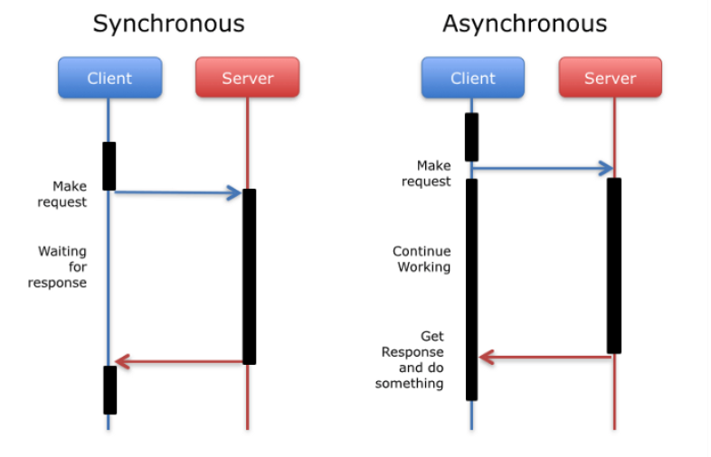
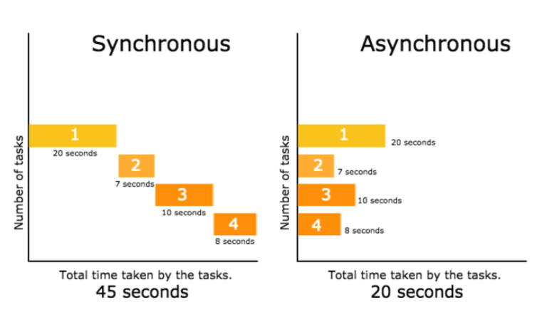

# Synchronous VS Asynchronous

- JavaScript에서 일반적으로 함수를 생성하여 실행하면 동기적(Synchronous)으로 순차적으로 작동한다. 하지만 web이 작동함에 있어서 다양하고 많은 기능들이 내부적으로 실행되는데 이 때 만약 어떤 기능이 실행됨에 있어서 그 작업이 heavy하고 따라서 시간이 오래 걸린다면 그 webpage는 어떤 작업을 실행해서 완료하는데 시간이 오래걸리기 때문에 좋은 Performance를 갖는 web이라고 하기 어렵다. 오래걸리는 어떤 작업이 그 기능을 완료하는 시간동안 다른 작업들은 실행이 안되고 대기상태이기 때문이고 이것을 blocking 이라고 한다. 이런 작동방식으로 인해 web의 performance가 저하되는 것이 Synchronous 방식의 약점이자 단점이라고 할 수 있다.

- Synchronous방식의 약점을 보완하고 web의 performance를 개선하기 위한 방식이 바로 Asynchronous, 비동기적 방식이다. Asynchronous는 다른 작업들의 소요시간에 영향을 받지않고 각자 작업을 하고 완료되면 그 기능을 하게 하는 방식이다. 대표적으로 network 통신을 통해 서버같은 곳에서 data를 받아와서 실행하는 경우가 있다. 어떤 작업이 server에 data를 요청하고 server가 요청받은 작업을 수행하고 결과를 반환하는 시간동안 다른 작업들은 대기하고 있는게 아니고 순서대로 실행이 된다. 그 다음 server에 data를 받아오면 그 때 실행이 된다.<br><br>
  
  

- Asynchronous 도 문제점이 없지는 않다. 어떤 작업들이 비동기적으로 실행이 되는 도중에 우리가 원하던 원하지 않던 어떤 작업이 완료되는 시점에 그 작업이 실행이 되거나 또는 어떤 결과값을 노출될 수도 있다. 뿐만 아니라 그 시점도 환경에 따라 다를 수 있어서 여러가지 문제점이 발생한다.
  따라서 Asynchronous 방식에서는 모든 작업들을 비동기적으로 실행함으로서 효율성은 올리되 그 작업들의 실행 순서를 제어할 수 있어야 한다. 이 때 사용할 수 있는것이 `callback`, `promise`, `async & await` 이다.

# Asynchronous - callback

- callback은 어떤 함수의 parameter로 또 다른 함수를 전달받음으로써 그 함수를 인자로 받는 함수가 실행 될 때만 실행되는 함수를 callback 함수라고 한다.

```js
function print(str) {
  console.log()
}


// sayHello함수에 callback parameter로 함수를 받고

function sayHello(callback, hello) {
  callback(hello)
}

// 이 때 print함수는 sayHello함수의 callback함수이다.
sayHello(print, 'hello')
```

```js
let arr = [1, 2, 3, 4]

// Array의 method를 사용할 때 인자로 callback함수를 받는다.
// callback함수는 보통 arrow function 표현식으로 인자를 넘긴다.
arr.map(el => el * 2)
```

- 위의 callback함수 실행은 Synchronous한 방식으로 쓰는 callbakc 함수이지만 callback은 그 callback함수를 인자로 받는 함수가 실행이 되지 않으면 callback함수도 실행이 되지 않기 때문에 이 특징을 이용하면 비동기적인 방법으로 작업이 실행되게 할 수 있다. 그럼 callback을 이용한 비동기적 실행의 원리를 예제를 통해서 이해해보자.

```js
// 1000 미만의 random한 숫자를 반환하는 함수
function randomWait() {
  return Math.floor(Math.random() * 1000)
}

const printString = string => {
  setTimeout(() => console.log(string), randomWait())
}

const printAll = () => {
  printString('good morning')
  printString('good afternoon')
  printString('good night')
}
```

- 위의 함수 printAll을 실행 했을 때 console.log에 찍히는 결과는 매번 순서가 다르다. printString 함수 각각이 서버통신을 통해서 받아온 결과를 갖고 뭔가를 실행하는 기능을 갖은 함수라고 한다면 각각의 함수는 그 작업이 완료되면 실행을 하는데 완료되기까지 소요되는 시간이 매번 다르기 때문이다. 이 때 Callback으로 인자를 넘기는 방식을 통해서 순서를 제어 할 수 있다.

```js
function randomWait() {
  return Math.floor(Math.random() * 1000)
}

const printString = (string, callback) => {
  setTimeout(() => console.log(string), randomWait())
  callback()
}

const printAll = () => {
  printString('good morning', () => {
    printString('good afternoon', () => {
      printString('good night', () => {})
    })
  })
}

printAll()
/* 
good morning
good afternoon
good night
*/
```

- printAll함수의 실행 결과로 똑같은 순서의 결과값이 나오는것을 확인 할 수 있다. 이처럼 각각의 기능이 소요하는 시간은 다르지만 빨리 작업이 완료됬다고 먼저 실행되지 않게 callback을 통한 Asynchronous방식으로 제어하여 순서대로 실행되게 할 수 있다.
- 하지만 callback으로 제어해야할 비동기 작업이 많으면 많을 수록 계속 callback 인자로 함수를 넘겨서 코드를 작성해야 하는데 그러면 계속 callback 함수가 nesting 되면서 나중에 가독성도 떨어지고 코드로 구현하기도 힘들다. (**_callback hell_**)
- callback hell을 방지하기 위해 우리는 promise를 써서 Asynchronous 방식을 구현할 수 있다.

# Asynchronous - Promise

- Promise는 JavaScript built-in prototype object이다.
- Asynchronous한 방식으로 실행해야 되는 작업을 Promise의 instance로 생성한다.
- Promise는 3가지 state을 갖고 있다.
  - `Pending` : 작업이 완료되지 않은 상태
  - `Fulfilled` : 작업이 완료되고 성곡적으로 data를 받아온 상태
  - `Rejected` : 작업이 완료되었지만 실패하여 error를 받아온 상태
  - pending -----> fulfilled or rejected
- Promise는 `excutor` callback함수를 인자로 받고 그 excutor callback함수는 `resolve` 와 `reject` 를 인자로 받는다.
  - resolve : Promise작업이 fulfilled 되었을 때 받아온 data를 전달받는다.
  - reject : Promise작업이 rejected 되었을 때 그에대한 error를 전달받는다.
- Promise Prototype은 `.then`, `.catch`, `.finally` 등의 method를 갖고 있다.
- `.then`은 callback 함수를 인자로 받고 그 callback 함수는 Promise의 resolve를 통해 받아온 data를 인자로 받는다.
- `.catch`는 callback 함수를 인자로 받고 그 callback 함수는 Promise의 reject를 통해 받아온 error를 인자로 받는다.
- `.finally`는 callback 함수를 인자로 받고 resolve 또는 reject 통해서 받아온 결과와 상관없이 뭔가를 실행할 때 사용한다.

## Promise - Producer & Consumer

- `Producer` : 비동기적으로 작동하는 어떤 Promise를 생성하는 코드

```js
const promise = new Promise((resolve, reject) => {
  // ...doing some heavy work (network, read file..etc)
})
```

**💥 Producer는 일반적인 함수 선언문이 아니기 때문에 Promise를 생성함과 동시에 인자로 받은 excutor 함수를 실행한다.**

- 함수를 통한 Promise 생성

```js
const getData = () => {
  return new Promise((resolve, reject) => {
    // ...doing some heavy work
  })
}
```

- `Consumer` : Promise를 통해 완수한 작업의 결과를 받아서 뭔가를 실행하는 코드

```js
getData()
  .then(data => data)
  .catch(error => console.log(error))
  .finally(() => console.log('completed the request'))
```

## Promise Practice

- Asynchronous-callback 에서 연습한 예제를 Promise를 사용하여 똑같이 비동기적인 기능들을 control하여 실행해보자.

```js
function randomWait() {
  return Math.floor(Math.random() * 1000)
}

// Promise Producer
const checkString = data => {
  return new Promise((resolve, reject) => {
    if (typeof data === 'string') {
      setTimeout(() => resolve(data), randomWait())
    } else {
      reject('not string')
    }
  })
}

// Promise Consumer
const printAll = () => {
  return checkString('good morning')
    .then(str => {
      console.log(str)
      return checkString('good afternoon')
    })
    .then(str => {
      console.log(str)
      return checkString('good night')
    })
    .then(str => console.log(str))
    .catch(err => console.log(err))
    .finally(() => console.log('Completed Printing All'))
}
```

- 위와 같이 Promise 를 통하여 callback에서 구현한 동작을 똑같이 구현했다. PrintAll함수는 **Promise의 method들을 chaining하는** 방식으로 구현되었고 chaining을 통해 값을 전달 할 때는 data도 전달되지만 **_새로운 Promise 객체도 전달_**되는 것을 확인 할 수 있다.
- 이 때, `.catch`는 chaining된 작업이 실행되는 동안 어떤 promise가 작업에 실패하여 reject를 통해 error data를 전달받는다면 그 에러를 받아서 callback함수를 실행한다. 모든 비동기 작업 각각에 대하여 error handling 할 필요가 없다.
- `.finally` 는 비동기 작업이 완료되면 인자로 받은 callback함수를 실행한다.

## Promise.all

- `promise.all`은 여러가지의 비동기적인 작업을 chaining할 때 순서대로 각각의 비동기 작업을 실행하면서 각각의 결과값을 취합하는것이 아니라 한번에 모든 비동기 작업을 동시에 실행하고 결과값을 한번에 받아서 다음작업을 실행할 수 있게 한다.
- array type으로 인자를 받고 그 array는 Promise 객체를 요소로한다.
- 각 비동기 작업의 결과값을 요소로 하는 배열을 리턴한다.
- promise practice로 구현한 printAll함수를 Promise.all을 써서 구현해보자.

```js
const printAll = () => {
  return Promise.all([
    checkString('good morning'),
    checkString('good afternoon'),
    checkString('good night'),
  ]).then(arr => arr.forEach(data => console.log(data)))
}
```

- 이 때, `Promise.all` 인자로 받는 비동기 작업들 중에 가장 오래걸리는 작업이 완료되면 `.then`에 결과를 넘겨주고 그 이하가 실행이된다.

- 이처럼 Callback으로 비동기적 작업을 제어하는 방식보다 Promise로 구현했을 때 구현방식이나 가독성이 훨씬 쉬워졌다. 하지만 Promise도 여전히 callback과 마찬가지로 control해야 하는 비동기 작업이 많아질수록 chaining이 길어지므로 callback hell --> promise hell 이 발생할 수 있다. 그러면 또 가독성도 떨어지고 구현하기도 힘들어질 것이다.
- 그래서 Promise가 작동하는 원리기반으로 조금 더 문법적으로 쉽게(Synthetic Sugar) 할 수 있도록 하는것이 바로 async & await 이다.

# Asynchronous - async & await

- `async` 와 `await`은 Promise로 Asynchronous 구현되는 원리와 똑같이 작동하되 조금 더 가독성이 높고 조금 더 쉽게 코드로 비동기 함수를 구현 할 수 있다.
- `async`는 `return new Promise` 하는 어떤 함수를 new Promise를 리턴하는 코드 없이 똑같이 Promise 객체를 리턴하는 함수로 만든다.
- `await`은 async function scope에 한하여 사용 가능하고 Promise객체를 리턴하는 함수에 대하여 사용가능하다.

## async & await practice

```js
function randomWait() {
  return Math.floor(Math.random() * 1000)
}

// Promise Producer
const checkString = data => {
  return new Promise((resolve, reject) => {
    if (typeof data === 'string') {
      setTimeout(() => resolve(data), randomWait())
    } else {
      reject('not string')
    }
  })
}

const printAll = async () => {
  let morning = await checkString('good morning')
  console.log(morning)
  let afternoon = await checkString('good afternoon')
  console.log(afternoon)
  let night = await checkString('good night')
  console.log(night)
}
```

- printAll함수를 `async function` 으로 만들고 각각의 Promise 객체를 리턴하는 비동기 함수들을 await을 써서 결과값을 받아서 각각의 변수에 할당한 다음 순서대로 console.log로 출력하였다.

```js
const printAll = async () => {
  let morning = await checkString('good morning')
  let afternoon = await checkString('good afternoon')
  let night = await checkString('good night')
  console.log(morning)
  console.log(afternoon)
  console.log(night)
}
```

- 이 때 각각의 비동기 함수들은 순서대로 실행되고 모든 비동기 함수가 완료되면 그 이하의 console.log들은 time delay없이 실행된다.
- 이 작동방식은 마치 Promise.all을 사용했을 때처럼 모든 비동기함수의 결과값을 취합해서 한번에 출력하는것과 비슷하지만 Promise.all과는 다르게 순서대로 실행되며 Promise.all은 모든 비동기 함수들이 병렬적으로 동시에 실행된다는 차이점이 있다.
- **👍 이처럼 `async` & `await`은 JavaScript에서 일반적으로 사용하는 다름 함수들과 비슷한 로직으로 작성하고 실행되기 때문에 callback 또는 Promise를 사용하는 것보다 조금 더 직관적으로 이해하고 사용할 수 있는 장점이 있다.**
